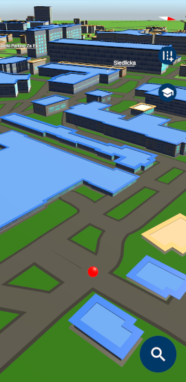

# GUT Guide
> Have you ever got lost at the Gdańsk University of Technology?

## Table of contents
* [General info](#general-info)
* [Screenshots](#screenshots)
* [Technologies](#technologies)
* [Features](#features)
* [Status](#status)
* [Contact](#contact)

## General info
This project is a software part of my master thesis titled "Analysis of the possibility of using Google Maps Platform Gaming Services to generate a realistic terrain model in real-time". The main goal is to get terrain as similar to reality as it is possible. All this with buildings 3D model procedural generation.

This is an application that helps get familiar with Gdańsk University of Technology campus. If you get lost this is the best tool that you could have on your phone. It enables you to find every building that you want and even find the best path to each building.

## Screenshots

## Technologies
* **Unity** - version 2020.1.17f1
* **Google Maps SDK for Unity** - version 1.0.1438.0
* **C#** - version 7.3

## Features
List of features ready
* dynamic generation of the 3D modeled map objects based on Google Maps Platform data 
* dynamic generation of buildings 3D models based on google Maps Platform metadata
* texturing all generated models
* recognition of the GUT buildings with special texturing for better distinguish capabilities
* list of all GUT buildings for easy search by the name, building name shortcut, or address
* feature of track the position of the searching building after clicking its element in the search list by the arrow pointing it
* street names labels for better orientation of the neighborhood, based on Google Maps Platform
* mode of focusing at the Gmach Główny building and the user real-world location

## Status
Project is: **_finished_**

## Contact
Created by Maciej Niklas, kontakt@mniklas.pl - feel free to contact me!